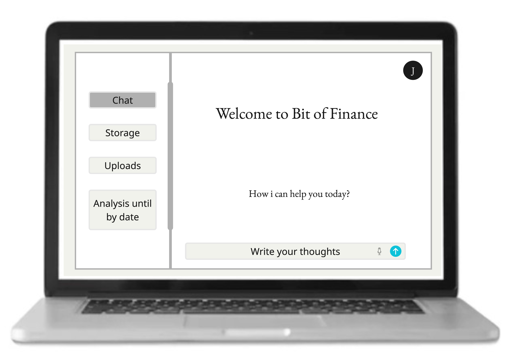
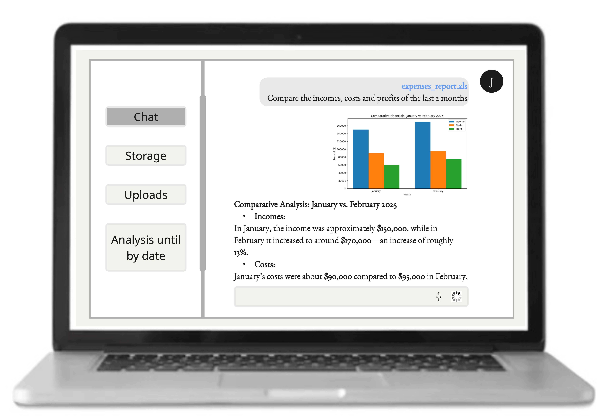
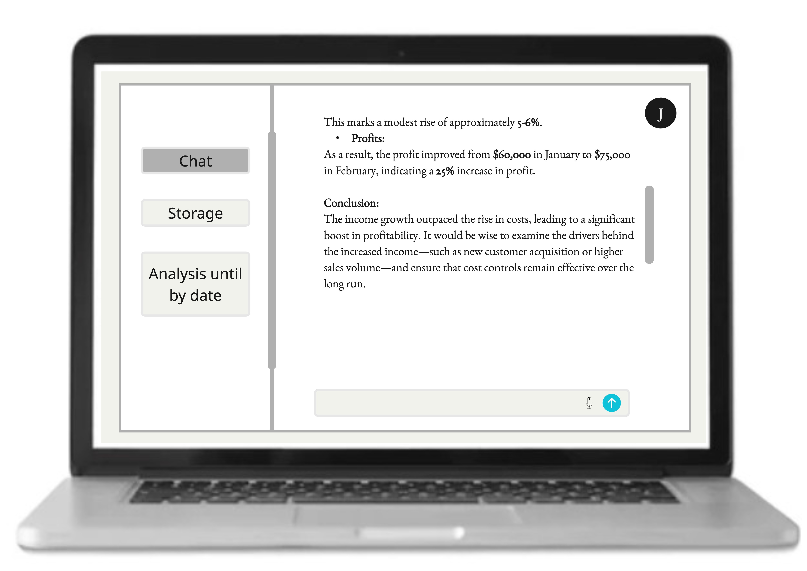
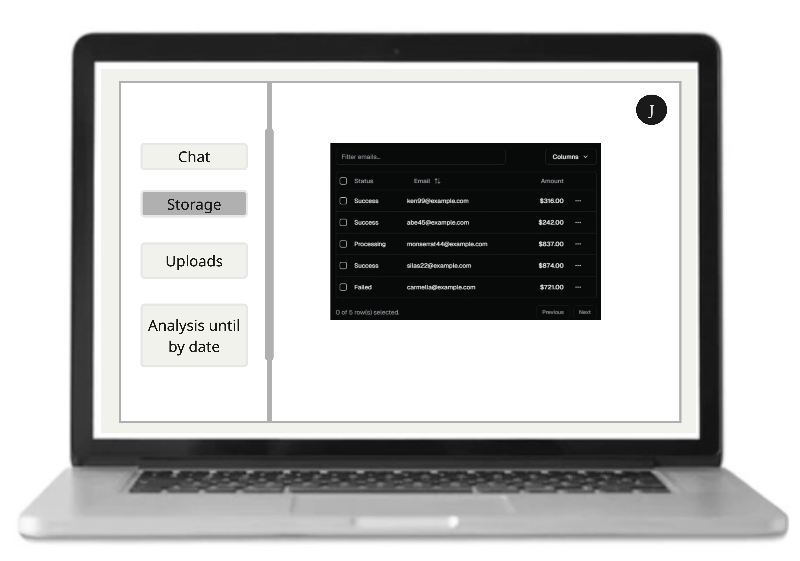
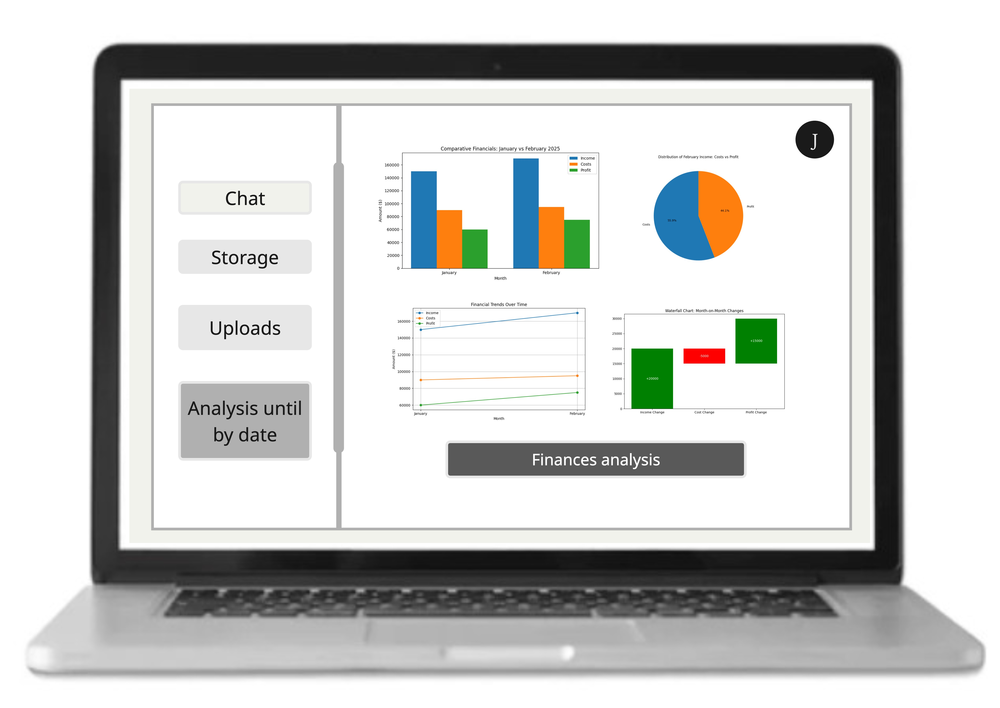
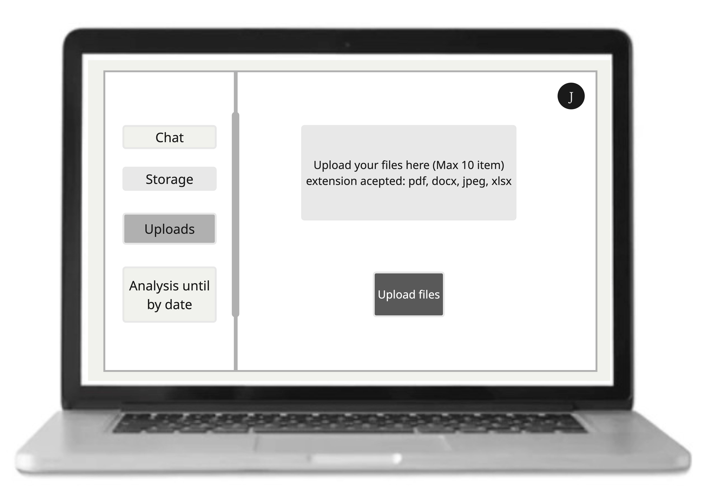

# Guru App Mockup

Below is a brief overview of the mockup images located in the `imgs/` folder, along with explanations of how each image fits into the Guru App flow. Each image provides a different view of the user interface and the functionalities we aim to deliver.

---

## 1. `Principal`

**Description:**  
- The main or “welcome” screen, greeting the user with a simple prompt: “How can I help you today?”  
- Shows the left hand menu with sections such as **Chat**, **Storage**, **Uploads**, and an **Analysis** button.  
- Sets the tone for the app, providing a minimal and clean interface so users immediately see where to start.

---

## 2. `Chat screen with a request from the user`

**Description:**  
- Illustrates the conversation area where users can type or speak queries, like “Compare incomes, costs, and profits of the last two months.”  
- Displays a list of files or relevant documents (e.g., PDFs, spreadsheets) that the AI assistant may use for context.  
- Highlights the real-time interaction with the AI, focusing on how the system retrieves and presents data from uploaded documents.

---

## 3. `Chat with Analysis`

**Description:**  
- Shows a more detailed response from the AI in the chat window, including basic financial charts (e.g., bar charts, pie charts) to illustrate comparative figures.  
- Demonstrates how users can see both numerical results and visual insights (such as changes in income vs. costs).  
- Emphasizes the ability to retrieve multiple files at once to compile a combined analysis.

---

## 4. `Extended Chat Explanation`

**Description:**  
- Continues the conversation with more in depth commentary on financial data, possibly pointing out cost variances or profit margins.  
- The AI provides a short conclusion or recommendation, e.g., “Consider examining the drivers behind the increased income to maintain profitability.”  
- Highlights how the assistant can give a concise yet explanatory overview of the findings.

---

## 6. `Storage View`

**Description:**  
- Represents how files are managed within the app possibly showing a table with columns for file status, email (if shared), or amounts.  
- Allows filtering, viewing the current files in storage, or performing other organizational tasks (e.g., delete, rename).  
- Reinforces the “one stop” nature of Guru App by combining both chat functionality and file management in a single interface.

---

## 5. `Analysis Dashboard`

**Description:**  
- Displays a dedicated analysis screen with various charts (bar, line, pie, waterfall) that compare income, costs, and profits across different months.  
- Offers a high-level dashboard for quick overviews rather than purely text-based interaction.  
- Perfect for users who prefer a visual snapshot of their financial status.

---

## 7. `Uploads Screen`

**Description:**  
- Demonstrates the upload area where users can add up to 10 files at once, supporting various extensions (PDF, DOCX, JPEG, XLSX).  
- Explains how the system takes in documents for subsequent analysis.  
- A straightforward drag and drop or file browser interface, ensuring simplicity for all user levels.

---

### Summary

Each of these images illustrates a part of the Guru App’s user journey:
- **Principal Screen** for welcoming and orienting users.
- **Chat Screens** (`chat.jpg`, `chat2.jpg`, `chat3.jpg`) showing conversational AI with contextual responses and embedded charts.
- **Analysis.jpg** for dashboard style visual overviews.
- **Storage.jpg** and **Uploads.jpg** for file management and organization in one place.

Taken together, these mockups provide a cohesive vision of how Guru App streamlines financial data uploads, interpretation, and presentation, making it easy for anyone—whether an individual or a small business owner—to gain actionable insights from their documents.
